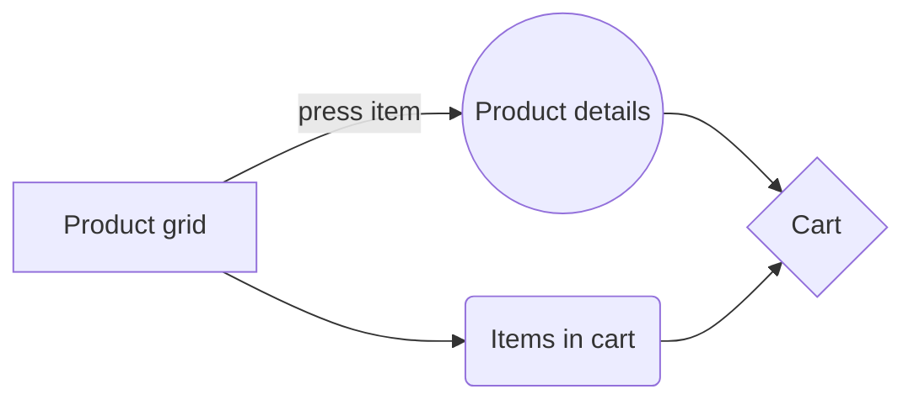

## Provider Shop

This is nothing but just a demo of how we can make an ecommerce shop using flutter and the design pattern Provider.

If you are in a hurry to spin up an ecommerce app, you can clone this code and then you customize it 
the way you want and you'll get a nice  and simple app to maintain

And this is the basic app flow chart:

## Getting Started

This project is a starting point for a Flutter application.

A few resources to get you started if this is your first Flutter project:

- [Lab: Write your first Flutter app](https://docs.flutter.dev/get-started/codelab)
- [Cookbook: Useful Flutter samples](https://docs.flutter.dev/cookbook)

For help getting started with Flutter development, view the
[online documentation](https://docs.flutter.dev/), which offers tutorials,
samples, guidance on mobile development, and a full API reference.
